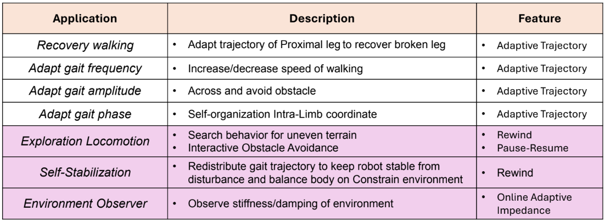
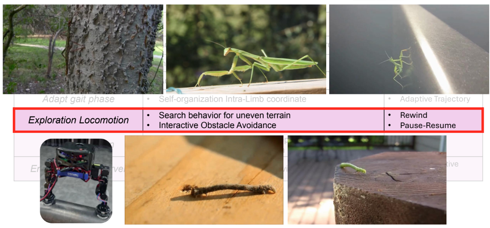
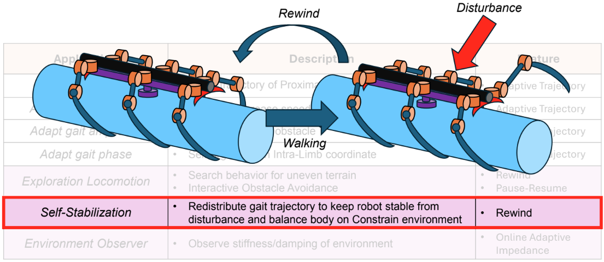

# InteractiveSearchLocomotion

This repository was created for my master's thesis titled "Intra-Limb Adaptive Compliance-Based Locomotion Learning Control." The research is a collaboration between the Bio-Inspired Robotics and Neural Engineering Laboratory (BRAIN) at the School of Information Science and Technology, Vidyasirimedhi Institute of Science and Technology (VISTEC), and PTT Exploration and Production Public Company Limited (PTTEP).

The project's goal is to develop an underwater six-legged robot for undersea pipeline inspection. This repository specifically focuses on the adaptive locomotion control module.

# Conceptual Control Design
The diagram below consists of three main modules: Adaptive Locomotion, Locomotion Learning, and Interaction Control.

This figure below show the goal features:

- Locomotion Learning: The robot can learn the desired joint trajectory through human demonstration within a few seconds.
- Adaptive Locomotion: The robot can adjust its locomotion to maintain stable movement along the pipeline.
- Environment Observer: The robot monitors its environment through joint impedance feedback (e.g., interactions with obstacles or damp surfaces) and adapts its impedance accordingly to enhance gripper holding force.

# Application

## Contact
run.janna@gmail.com, runj_pro@vistec.ac.th